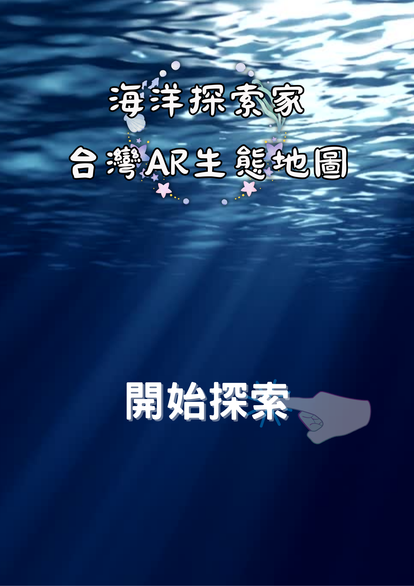
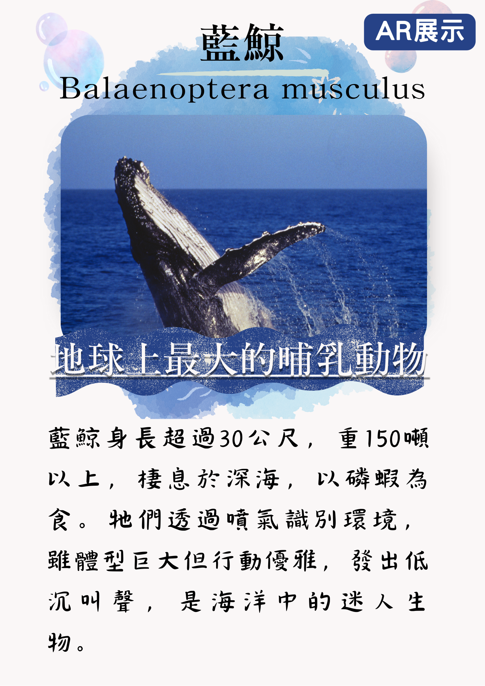
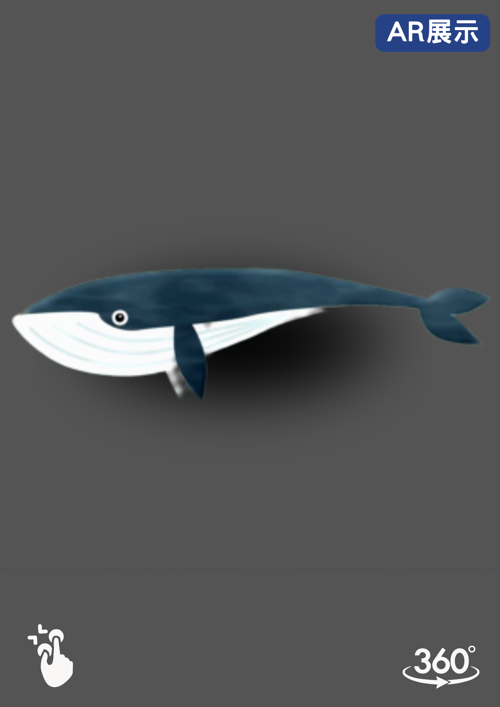
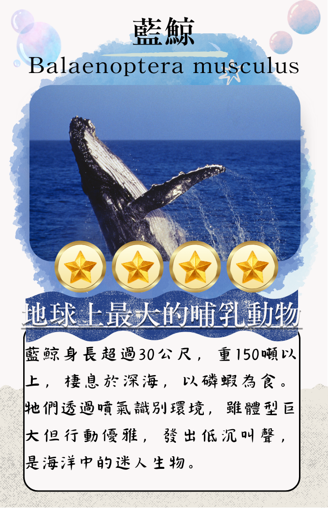

# 台灣海洋生態地圖🌊+圖卡
## 歡迎畫面
顯示海洋背景動畫，並加入「開始探索」按鈕。

## 選擇模式
用戶可選擇地圖探索模式和圖卡掃描模式。

## 地圖探索模式
瀏覽台灣海洋地圖，點擊生物圖標後，顯示該生物的資訊。

## AR互動展示(放在地圖探索模式中)
掃描QR解鎖後，啟動生物的資訊中有AR模式，點開AR模式就會顯示該生物的3D模型與其活動場景（例如藍鯨的遨遊動畫）。
用戶可旋轉、放大縮小

## 圖卡掃描模式
使用相機掃描圖卡的QR Code，可以看到該生物的AR動畫/建模。

## 知識互動與問答(該部分先暫為保留)
顯示該物種的簡介（如棲息地、特徵、行為習性）。
問答題挑戰：每次回答正確可獲得積分並解鎖該物種的AR動畫。

## 圖卡樣式

